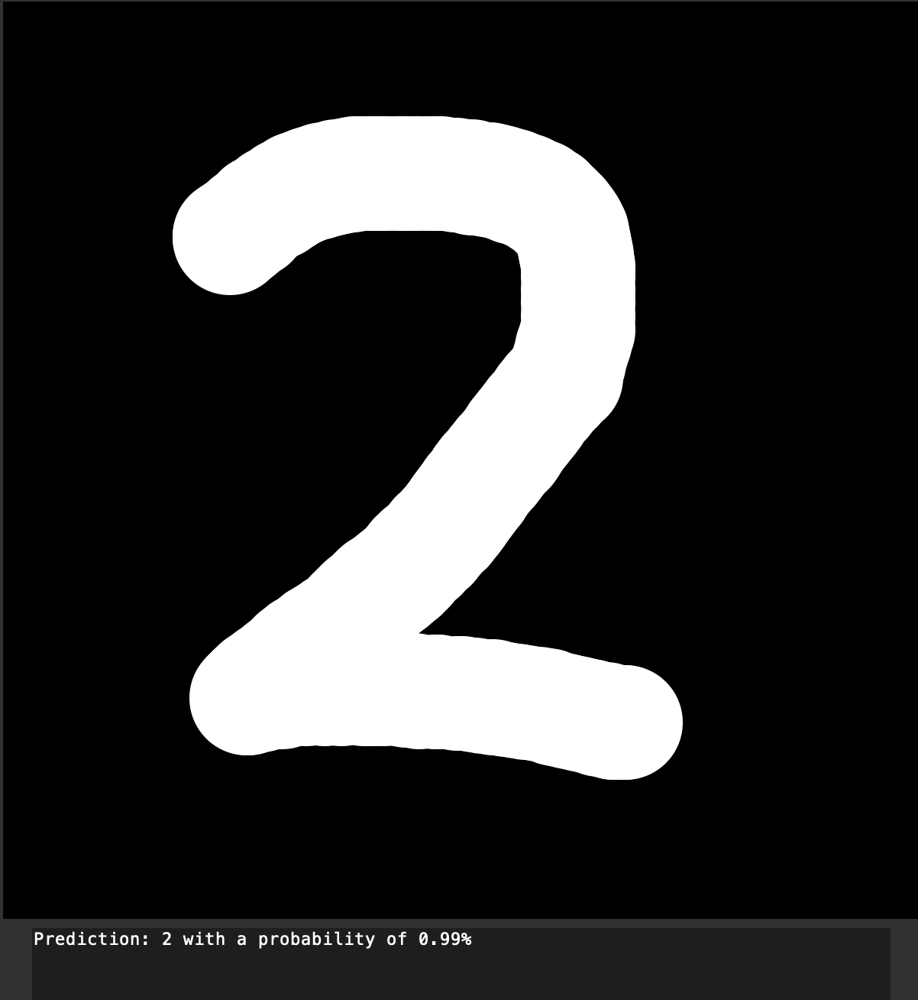

# MNIST Neural Network
This project is a simple implementation of a neural network that is trained to recognize handwritten digits from the MNIST dataset.

## GUI
The project includes a graphical user interface (GUI) built with tkinter that allows the user to draw a digit on a canvas and have the neural network predict which digit it is. The GUI also includes the following buttons:

* Run: This button runs the image on the canvas through the neural network and displays the prediction in a text field.
* Clear Canvas: This button clears the canvas.
* Open Webcam: This button opens the webcam and passes the picture through the neural network for a prediction.
* Load Model: This button loads a presaved model for the neural network.
* Performance: This button tests the current model's accuracy on the test dataset and displays the result in a text field.
* Train Model: This button trains the neural network on the training dataset.

## Neural Network
The neural network in this project is implemented from scratch using 3 layers: an input layer, a hidden layer, and an output layer. The connections between the layers are stored in numpy arrays as matrices. The activation function used is the sigmoid function. The neural network includes methods for training, saving and loading a model, and querying the model with new data.

The current presaved model was trained on the 60000 image training dataset for 5 epochs, meaning it was passed through the entire dataset 5 times. The model has 784 input nodes, 250 hidden nodes, and 10 output nodes (one for each digit). The accuracy of this model when tested on the 10000 image test dataset is over 97%.

